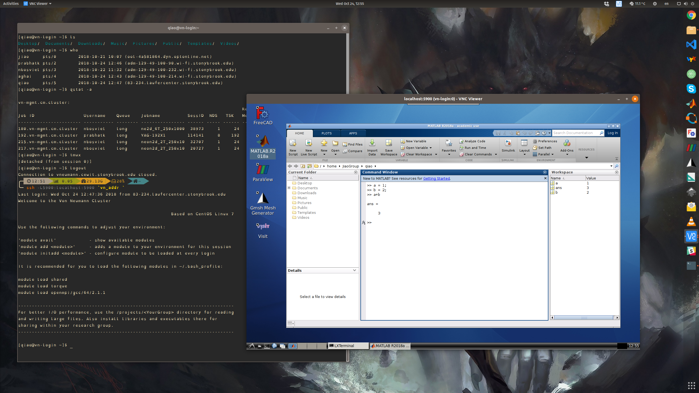
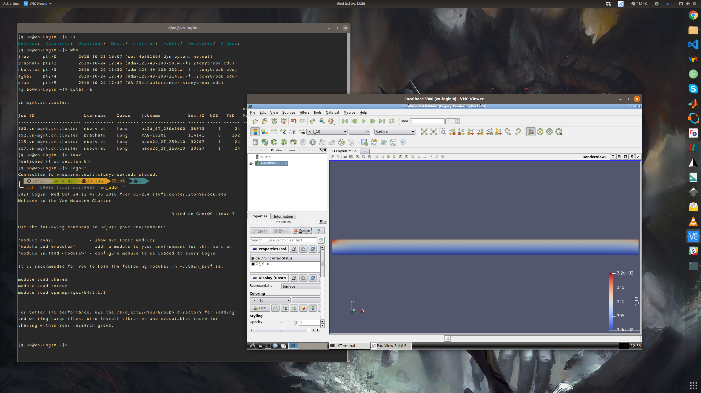
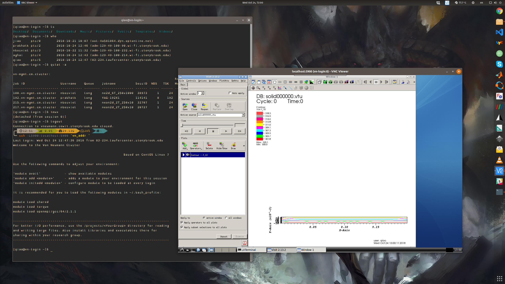
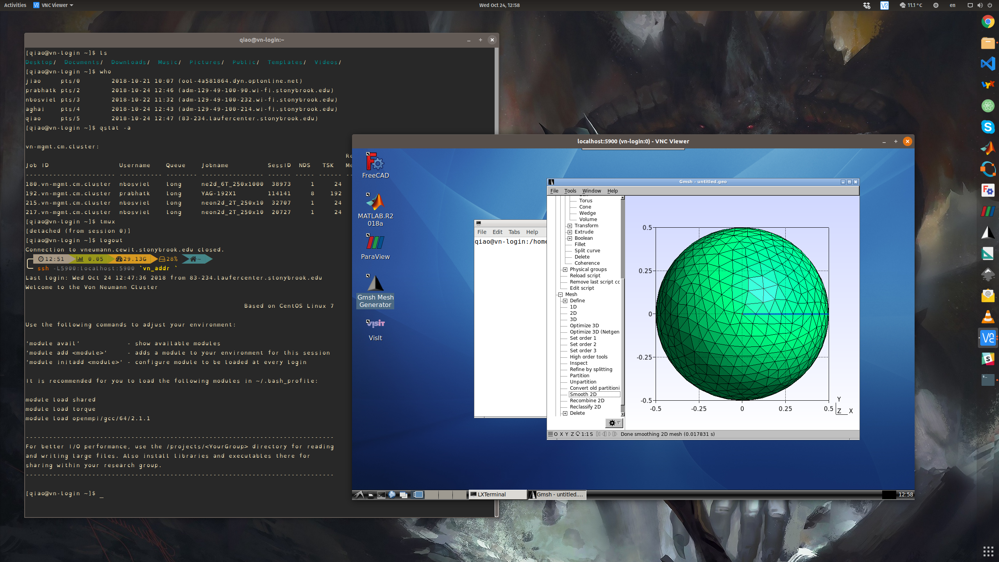
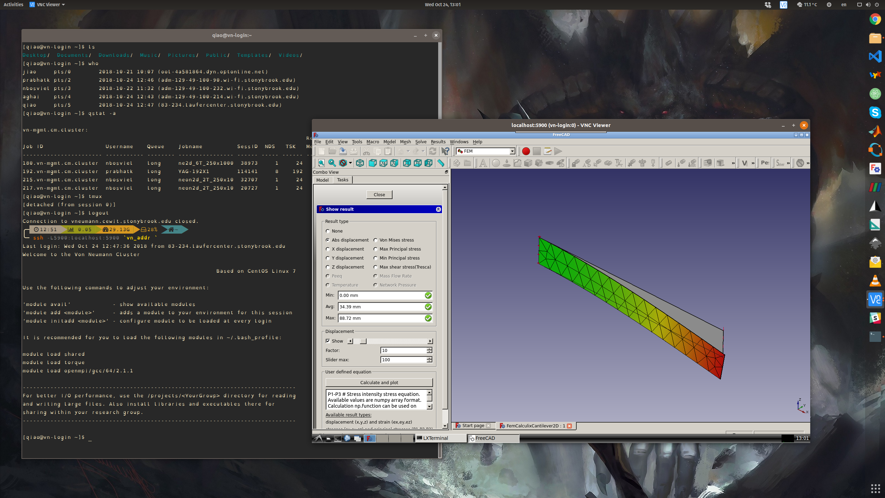

# X11 VNC Docker/Singularity image for Von Neumann cluster @ Stony Brook University

This is an unportable image that is customized for Von Neumann cluster for using
OpenGL applications.

For better performance, please consider using [VNC Viewer](https://www.realvnc.com/en/connect/download/viewer/).

## Snapshot ##

**MATLAB**

**ParaView**

**VisIt**

**GMSH**

**FreeCAD**

